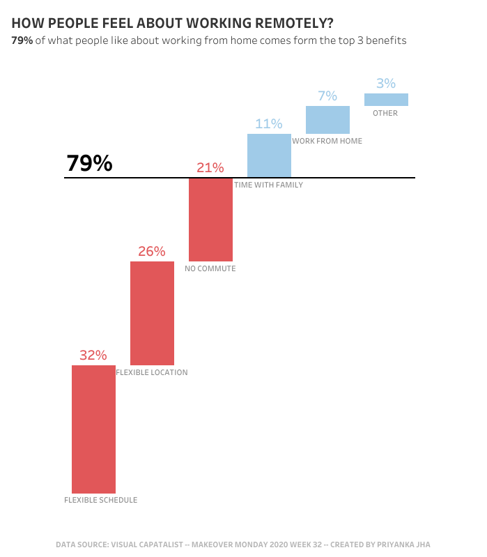
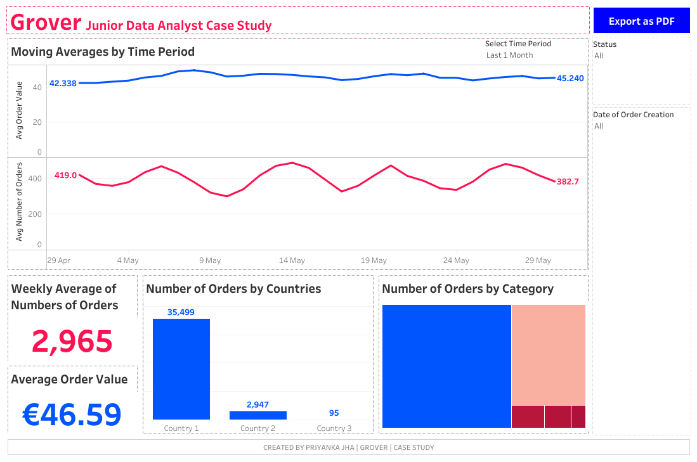
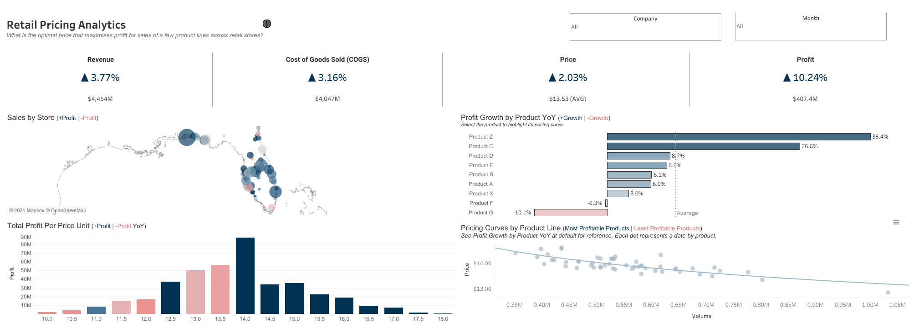
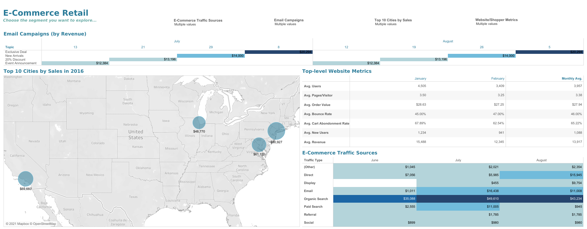
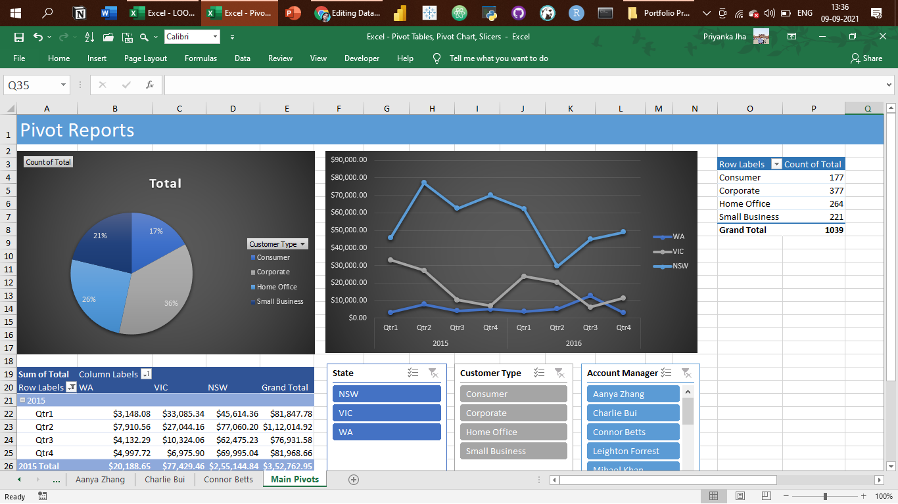

# Portfolio Projects
## Following are my projects in SQL, Python, Tableau & Excel:  
#### *You can also take a look at my Linkedin : *  

- [x] **SQL & Tableauclear
** - 
  - Instagram Clone Data Analysis Project 
** **[Dashboard]( https://drive.google.com/file/d/1tEP60ZEkFdI1cEs3ujQXitXhlNtOgSQG/view?usp=share_link  )** 
*Review the Data Insertion SQL Script:* **[HERE]** 
*Review the Data Exploration SQL Script:* **[HERE]** 

- [x] **Hadoop (Hive)** - 
  - NYC Yellow Taxi Records: Data Analysis  
*Review the HiveQL Script:* **[HERE]** 

- [x] **SQL** - 
  - Nashville Housing Dataset: Data Cleaning  
*Review the SQL Script:* **[HERE]** 

  - COVID-19 Dataset: Data Exploration   
*Review the SQL Script:* **[HERE]** 

- [x] **PostgreSQL** - 
  - Business Intelligence Challenge  
*Review the PostgreSQL Script:* **[HERE]** 
*Review the Google Slides Deck to see the Data Visualizations:* **[https://drive.google.com/file/d/1_QDnFWjeYjeHbl1txvA3bk6OGrMaYVPo/view?usp=share_link]** 

- [x] **Python** - 
  - Movies Industry Dataset: Exploratory Data Analysis Project  
*Read the complete Project Analysis in Markdown:* **[HERE]** 

- [x] **Tableau** - 

- #MakeoverMonday 2020 Week 32 | Benefits of Working from Home: https://drive.google.com/file/d/1XVIc-Oo4RO5KpTMMxlNa_pMK9cNFXuac/view?usp=share_link

  

- Municipality Data Analysis Dashboard: https://drive.google.com/file/d/1vdCMox9AsfOWa3PBd0xkRlbeojHmpY50/view?usp=share_link

  

- GROVER Junior Data Analyst Case Study Dashboard: https://drive.google.com/file/d/1NySrq3T4XCNcwAXmwclnaXkfJnR5hiMP/view?usp=share_link

  

- Retail Pricing Analytics Dashboard:

- E-commerce Sales Dashboard:

- Sales SuperStore Deep Data Analysis (5 Dashboards):
      
      1 KPI Dashboard

      2 Top-Down Dashboard
      

      3 Q&A Dashboard
      

      4 Bottom-Up Dashboard
      

      5 Geo Chart
      

- World Bank CO2 Emissions Dashboard: https://drive.google.com/file/d/1VDkxeTxy2JV-GR-RdRIButJVD-qagTEp/view?usp=share_link

- London Bus Safety Dashboard: https://drive.google.com/file/d/1jJYpa7kaMo1ItEDtRCLLxIKOuSNxWjca/view?usp=share_link

- [x] **Excel** - 

*Kindly download these Excel files from this repository and view them in Microsoft Excel.*

- Sales Superstore Sample: Sales Performance Dashboard  

- NetTRON Network Infrastructure Data : LOOKUP, INDEX, MATCH, SUMIFS  

- Shipping Data: Pivot Tables, Pivot Chart, Slicers  

- Project Costing Model Data: Scenario Manager, Solver (Data Modeling)

--------------------------------------------------------------------------------------------------------------------------------------------------------------------------------